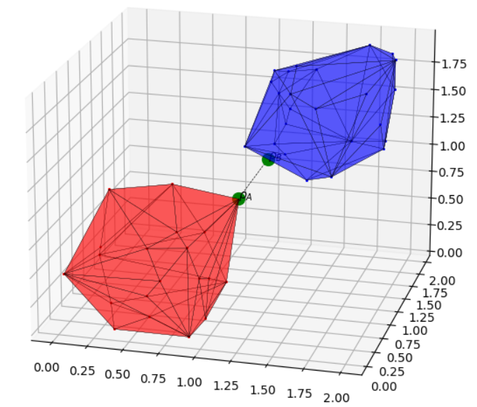

This library contains the implementations of the **[GJK](https://en.wikipedia.org/wiki/Gilbert–Johnson–Keerthi_distance_algorithm)** and **[EPA](http://uu.diva-portal.org/smash/get/diva2:343820/FULLTEXT01.pdf)** algorithms.
They are used a lot in the domain of computer graphics, to:

 * detect collisions between pairs of convex shapes
 * get the closest pair of points between pairs of convex shapes
 * get the penetration vector between pairs of convex shapes
 


With respect to other similar solvers, the one proposed allows to easily:

 * account for roto-traslation for the shapes, without explicitly computes the vertices coordinates after the roto-traslation
 * possibility to use a template container to describe your the convex shape, using the 3D coordinate representation
   of your favourite algebra library ([Eigen](https://eigen.tuxfamily.org/dox/group__TutorialMatrixArithmetic.html), etc...)
 
Before diving into the code, it is strongly recomended to have a look at the [documentation](./doc/GJK_EPA.pdf).

This library is stand-alone and completely **cross platform**. Use [CMake](https://cmake.org) to configure the project.

## USAGE

Haven't yet left a **star**? Do it now! :).
Performing proximity queries with this package is pretty easy. Let's assume to have defined a pair of convex shapes:
```cpp
// build the first convex shape ... have a look at the samples to understand
// how to do it
const flx::shape::ConvexShape &shapeA = ;
// build the second convex shape ... have a look at the samples to understand
// how to do it
const flx::shape::ConvexShape &shapeB = ;
```

We can simply check the presence of a collision:
```cpp
bool result = flx::is_collision_present(shapeA, shapeB);
// this will call only the initial iterations of the GJK (see the
// documentation) required to answer the query.
```

If we suspect the shapes ARE in collision, we can get the penetration
vector (see the documentation) by calling:
```cpp
std::optional<flx::CoordinatePair> result =
    flx::get_penetration_info(shapeA, shapeB);
// this will call the initial iterations of the GJK + the EPA ones in
// case the shapes are in collision.
//
// On the contrary, when the shapes are not in collision a std::nullopt is
// actually returned, and only the  initial iterations of the GJK are done.
//
// If the result is not null, you can access the extremals of the
// penetration vector:
if (std::nullopt != result) {
    const hull::Coordinate &point_on_shapeA = result->point_in_shape_a;
    const hull::Coordinate &point_on_shapeB = result->point_in_shape_b;
}
```

If we suspect the shapes ARE NOT in collision, we can get the
closest pair of points on the 2 shapes by calling:
```cpp
// this will call only initial iterations of the GJK + refining iterations
// of the GJK, evolving the plex till finding the closest region of the
// Minkowski difference to the origin. This is actually done only in case
// the shapes are not in collision.
//
// On the contrary, when the shapes are in collision a std::nullopt is
// actually returned, and only the  initial iterations of the GJK are done.
//
// If the result is not null, you can access the the closest pair from the
// result:
if (std::nullopt != result) {
    const hull::Coordinate &closest_point_on_shapeA =
        result->point_in_shape_a;
    const hull::Coordinate &closest_point_on_shapeB =
        result->point_in_shape_b;
}
```

...or, we can ask to perform a generic complex query that leads to call
the EPA or the finishing iterations of the GJK to respectively compute
the penetration vector or the closest pair:
```cpp
flx::QueryResult result =
    flx::get_closest_points_or_penetration_info(shapeA, shapeB);
// and then access the results (which might have 2 different meanings)
bool result_meaning = result.is_closest_pair_or_penetration_info;
if (result_meaning) {
    // is the closest pair
    const hull::Coordinate &closest_point_on_shapeA =
        result.result.point_in_shape_a;
    const hull::Coordinate &closest_point_on_shapeB =
        result.result.point_in_shape_b;
} else {
    // extremals of the penetration vector
    const hull::Coordinate &point_on_shapeA = result.result.point_in_shape_a;
    const hull::Coordinate &point_on_shapeB = result.result.point_in_shape_b;
}
```

## SAMPLES

The relevant code is contained in ./src, while ./Samples contains samples showing how to use this library.
In particular, after running the samples, some .json files will be produced storing the results.
A python script can be later used to visualize the results.

## CMAKE SUPPORT

Haven't yet left a **star**? Do it now! :).
   
To consume this library you can rely on [CMake](https://cmake.org).
More precisely, You can fetch this package and link to the **GJK-EPA** library:

```cmake
include(FetchContent)
FetchContent_Declare(
gjk_epa
GIT_REPOSITORY https://github.com/andreacasalino/Flexible-GJK-and-EPA
GIT_TAG        master
)
FetchContent_MakeAvailable(gjk_epa)
```
and then link to the **GJK-EPA** library:

```cmake
target_link_libraries(${TARGET_NAME}
    GJK-EPA
)
```